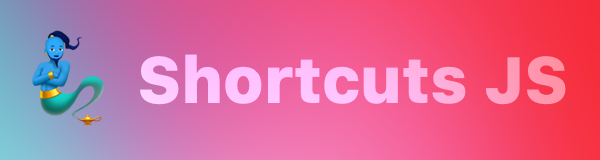
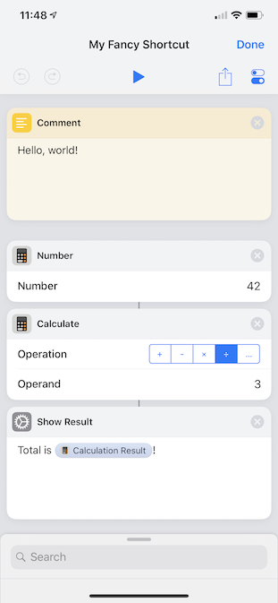
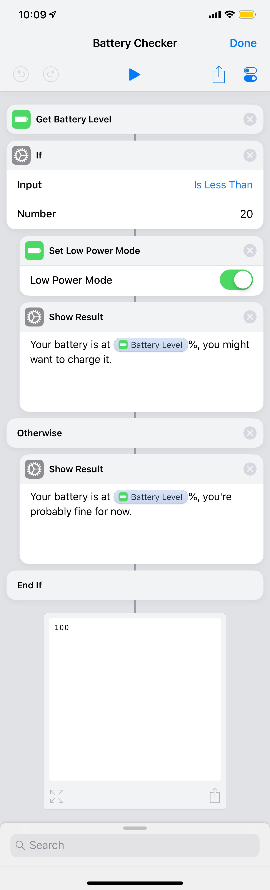

[](https://github.com/joshfarrant/shortcuts-js/blob/master/LICENSE)
[](https://www.npmjs.com/package/@joshfarrant/shortcuts-js)
[](https://travis-ci.org/joshfarrant/shortcuts-js)
[](https://coveralls.io/github/joshfarrant/shortcuts-js?branch=master)
[](https://github.com/joshfarrant/shortcuts-js/blob/master/.github/CONTRIBUTING.md)
[](https://discord.gg/pyvcYbB)

A Node.js iOS 12 Shortcuts creator.

Find out more at [Shortcuts.fun](https://shortcuts.fun).

[@joshfarrant/shortcuts-js](https://www.npmjs.com/package/@joshfarrant/shortcuts-js) on npm.

[NPM](https://www.npmjs.com/package/@joshfarrant/shortcuts-js) | [Documentation](https://docs.shortcuts.fun/globals.html) | [Contributing](https://github.com/joshfarrant/shortcuts-js/blob/master/.github/CONTRIBUTING.md) | [Medium](https://medium.com/@JoshFarrant/creating-ios-12-shortcuts-with-javascript-and-shortcuts-js-942420ca9904) | [Discord](https://discord.gg/pyvcYbB)

See [this issue](https://github.com/joshfarrant/shortcuts-js/issues/6) for a complete list of all Actions implemented so far.

We have a Discord! If you need any help or have any questions, come and say hi! [Join the Discord](https://discord.gg/pyvcYbB)

#### Is the Action you want not available?

We're still working our way through the long list of built-in Shortcut Actions, if there's one you need sooner rather than later then [Open an Issue](https://github.com/joshfarrant/shortcuts-js/issues/new/choose) and let us know; we might be able to prioritise it.

Alternatively, it's super easy to add an Action yourself! A simple Action should only take about 15 minutes to implement. Check out the [Contributing Guide](https://github.com/joshfarrant/shortcuts-js/blob/master/.github/CONTRIBUTING.md) for more info on where to start. If for any reason you get stuck just [Open an Issue](https://github.com/joshfarrant/shortcuts-js/issues/new/choose). We're happy to help!

## Minimal Example

```sh
npm install @joshfarrant/shortcuts-js
```

```js
// Only used to create the .shortcut file
const fs = require('fs');

const {
  actionOutput,
  buildShortcut,
  withVariables,
} = require('@joshfarrant/shortcuts-js');
const {
  calculate,
  comment,
  number,
  showResult
} = require('@joshfarrant/shortcuts-js/actions');

// We'll use this later to reference the output of a calculation
const calcVar = actionOutput();

// Define our list of actions
const actions = [
  comment({
    text: 'Hello, world!',
  }),
  number({
    number: 42,
  }),
  calculate({
    operand: 3,
    operation: '/',
  }, calcVar),
  showResult({
    /**
     * We can use the result of the calculation in this Shortcuts's input
     * by passing the string to the 'withVariables' tag function
     */
    text: withVariables`Total is ${calcVar}!`,
  }),
];

// Generate the Shortcut data
const shortcut = buildShortcut(actions);

// Write the Shortcut to a file in the current directory
fs.writeFile('My Fancy Shortcut.shortcut', shortcut, (err) => {
  if (err) {
    console.error('Something went wrong :(', err);
    return;
  }
  console.log('Shortcut created!');
});
```

Running this code will build a Shortcut named '_My Fancy Shortcut.shortcut_' in the current directory.

This can be AirDropped to an iPhone or iPad running iOS 12, at which point it will be automatically opened and imported into Shortcuts.



## Further Examples

For brevity, these examples omit the code for writing the file to disk and just focus on building the Shortcut. See the [Minimal Example](#Minimal-Example) above for an example of how to create the .shortcut file.


### Battery level checker, with conditional action

```js
const {
  actionOutput,
  buildShortcut,
  withVariables,
} = require('@joshfarrant/shortcuts-js');
const {
  conditional,
  getBatteryLevel,
  setLowPowerMode,
  showResult,
} = require('@joshfarrant/shortcuts-js/actions');

const batteryLevel = actionOutput();

const actions = [
  getBatteryLevel({}, batteryLevel),
  conditional({
    input: '<',
    value: 20,
    ifTrue: [
      setLowPowerMode({
        value: true,
      }),
      showResult({
        text: withVariables`Your battery is at ${batteryLevel}%, you might want to charge it.`,
      }),
    ],
    ifFalse: [
      showResult({
        text: withVariables`Your battery is at ${batteryLevel}%, you're probably fine for now.`,
      }),
    ],
  })
];

const shortcut = buildShortcut(actions);
```



### Shortcut folder creator

This example creates folders and subfolders of Shortcuts so they can be easily run from one 'Folder' Shortcut.

This Shortcut could be tedious to set up using the drag-and-drop interface of the Shortcuts app, however we can simplify the generation of this Shortcut by using a function to build our actions from a predefined array of strings.

```js
const {
  buildShortcut,
  withVariables,
} = require('@joshfarrant/shortcuts-js');
const {
  conditional,
  getBatteryLevel,
  setLowPowerMode,
  showResult,
} = require('@joshfarrant/shortcuts-js/actions');

const foldersArr = [
  ['Health', [ // The name of the folder
    'Log Sleep', // The names of Shortcuts to contain in that folder
    'Log Run',
    'Log Cycle',
  ]],
  ['Home', [
    ['Lights', [
      'Lights On', // We can go as many levels deep as we like
      'Lights Off',
    ]],
    ['Heating', [
      'Heating On',
      'Heating Off',
    ]],
    ['Cameras', [
      'Cameras On',
      'Cameras Off',
    ]],
    ['Door', [
      'Lock Door',
      'Unlock Door',
    ]],
  ]],
  ['Audio', [
    'Play Playlist',
    'Resume Podcast'
  ]],
];

const buildFolders = (arr) => (
  arr.map(shortcut => (
    Array.isArray(shortcut) ? ({
      label: shortcut[0],
      actions: [
        chooseFromMenu({
          prompt: shortcut[0],
          items: buildFolders(shortcut[1]),
        }),
      ],
    }
    ) : ({
      label: shortcut,
      actions: [
        runShortcut({
          name: shortcut,
        }),
      ],
    })
  ))
);

const actions = [
  chooseFromMenu({
    prompt: 'Open',
    items: buildFolders(foldersArr),
  }),
];

const shortcut = buildShortcut(actions);
```


## Anything Else

If you're having any issues getting started, or you'd just like some advice, then please don't be afraid to [Open an Issue](https://github.com/joshfarrant/shortcuts-js/issues/new/choose), we're here to help!
